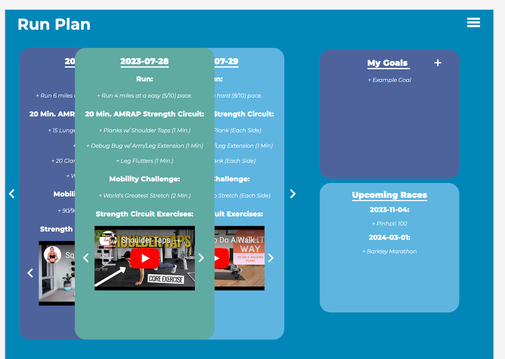
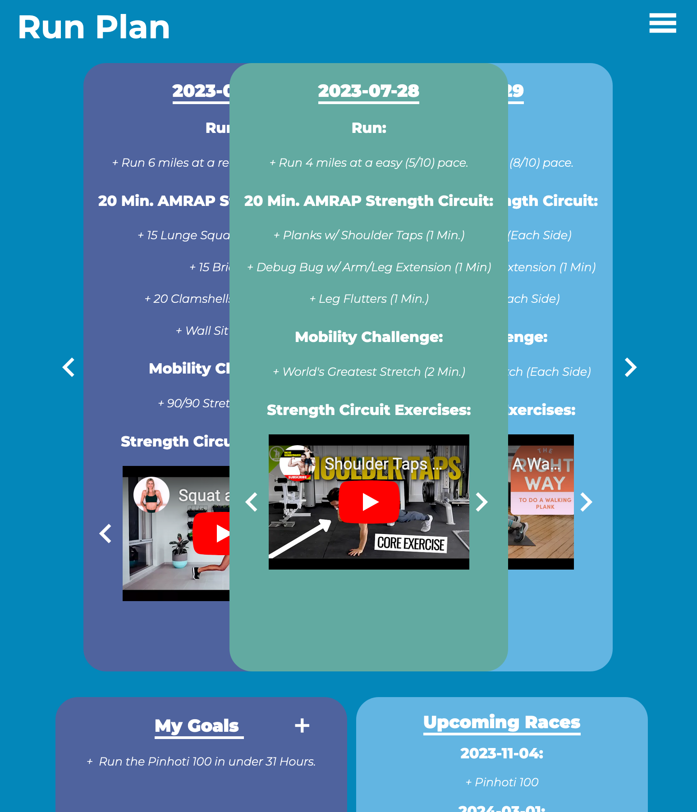

# Runplan

(Heads Up: The purpose of the project was to experiment with vue, django, and website deployment)

## What is Runplan?
- Runplan is a web-based application aimed at streamling training plans.
- Runplan is targeted at local running clubs that provide training plans.
- Runplan makes it fun for coaches and players to see their weekly training, make goals, and learn about upcoming races (and if a team member is competing in a race).

## Technologies Used
- Vue.js
- Vite
- Serve (Used to serve the 'built' project)
- Django
- PostgreSQL Server
- Responsive Design

Runplan is a single-page-application.

Runplan is split into two components: a front-end component (using Vue.js and Vite) that client side renders all CSS and HTML and a back-end component (using Django) that serves user data and handles authentication. Data on the back-end is configured to be stored on a Postgres server.

## Application Breakdown

## Login Page

Here, a user signs in with credentials provided by a coach.

## Dashboard Page

Here, a player can see yesterday's, today's, and tomorrow's workout. They can also scroll through previous and upcoming workouts, add, modify, or remove goals, and see any upcoming races.

Large Screen

Medium Screen

Small Screen

## Admin Page

Here, a coach can add the weekly training plans for a user, add upcoming races, and if they desire, update a user's goals.

