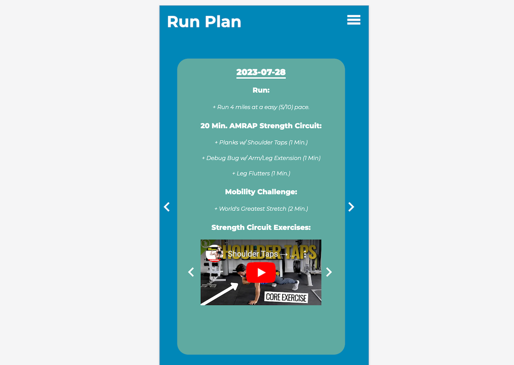

# Runplan

Runplan is a single-page web application written in Vue.js, Javascript, and Python.

(The page can be visited at https://run-plan-frontend-972a41e31320.herokuapp.com/ and images can be see down below)

## Purpose:
- Streamline training plans for local running clubs.

- Runplan makes it one-stop shop for coaches and players to see their weekly training, make goals, and learn about upcoming races.

## Front-End
- Vue.js
- Vite

## Back-End
- Django
- Postgres

## Application Breakdown

The application consist of three different pages: **Login Page**, **Dashboard Page**, and a **Coach's Page**

### Login Page

The aforementioned page verify a user's identity and associates a session id with it.

### Dashboard Page

The aforementioned page lets a user scroll through previous and upcoming workouts, add, modify, and remove goals, and also see any upcoming races.

Depending on the size of the device, the dashboard's layout will adjust.

### Coach Page

The aforementioned page lets a coach add workouts, upcoming races, and modify goals.

## Images

*Login Screen*

*Large Dashboard Screen*

*Medium Dashboard Screen*

*Small Dashboard Screen*

*Coach's Page*

